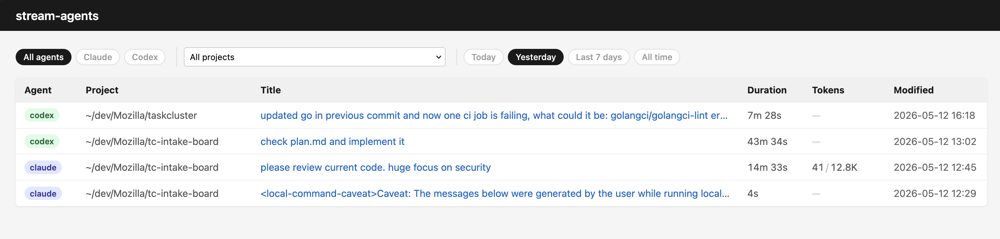
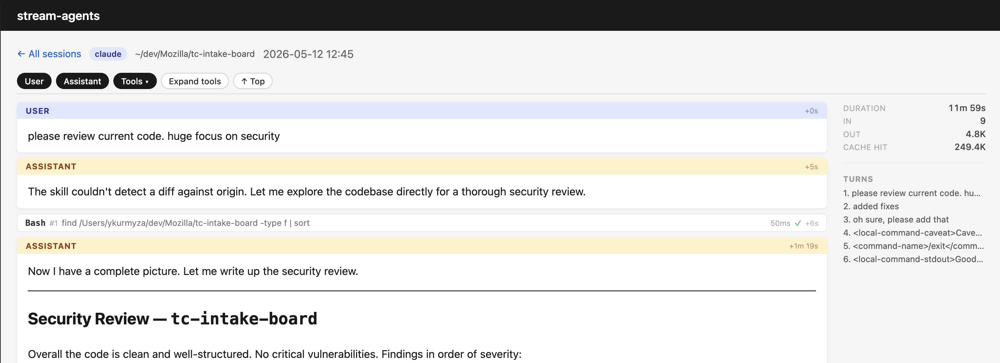

# stream-agents

`stream-agents` is a small local web viewer for AI agent transcripts. It scans
Claude and Codex JSONL session files, lists them by project and modified time,
and renders each transcript with Markdown, turn navigation, and collapsible tool
calls.

## Screenshots

Session list:



Transcript view:



## Requirements

- Go 1.23.6 or newer
- Local Claude and/or Codex transcript files

## Run

```sh
make run
```

The server listens on `http://127.0.0.1:7777` by default.

You can also run it directly:

```sh
go run ./cmd/server
```

Useful flags:

```sh
go run ./cmd/server \
  -addr 127.0.0.1:7777 \
  -claude-dir ~/.claude/projects \
  -claude-config-dir ~/.config/claude/projects \
  -codex-dir ~/.codex/sessions
```

## What It Reads

- Claude sessions from `~/.claude/projects` and `~/.config/claude/projects`
- Codex sessions from `~/.codex/sessions`

The app only reads local transcript files. Keep the default localhost bind unless
you are comfortable exposing your agent history on another interface.

## Development

```sh
make test
make build
make clean
```

Project layout:

- `cmd/server`: HTTP server entry point
- `internal/store`: Claude/Codex transcript discovery and parsing
- `internal/server`: routes, templates, and static assets
- `internal/render`: Markdown rendering

## Stats

Open **Stats** in the navigation (at `/stats`) for year, month, or day summaries
and an agent breakdown. Filter by project, agent, and inclusive date range.
Metrics include sessions, agent types, projects, transcript records, token usage
(input, output, cache reads/writes), and elapsed session duration.
Sessions are assigned to their start date in UTC, falling back to file modification
time when unavailable. Token coverage is shown because some transcripts omit usage.

Daily activity heatmaps show session counts for every year with matching data,
newest first, with
per-day session, token, and agent totals on hover or keyboard focus. It respects
the stats filters and uses UTC session start dates.
